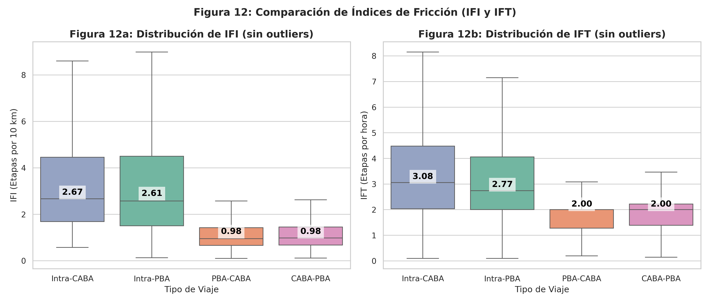
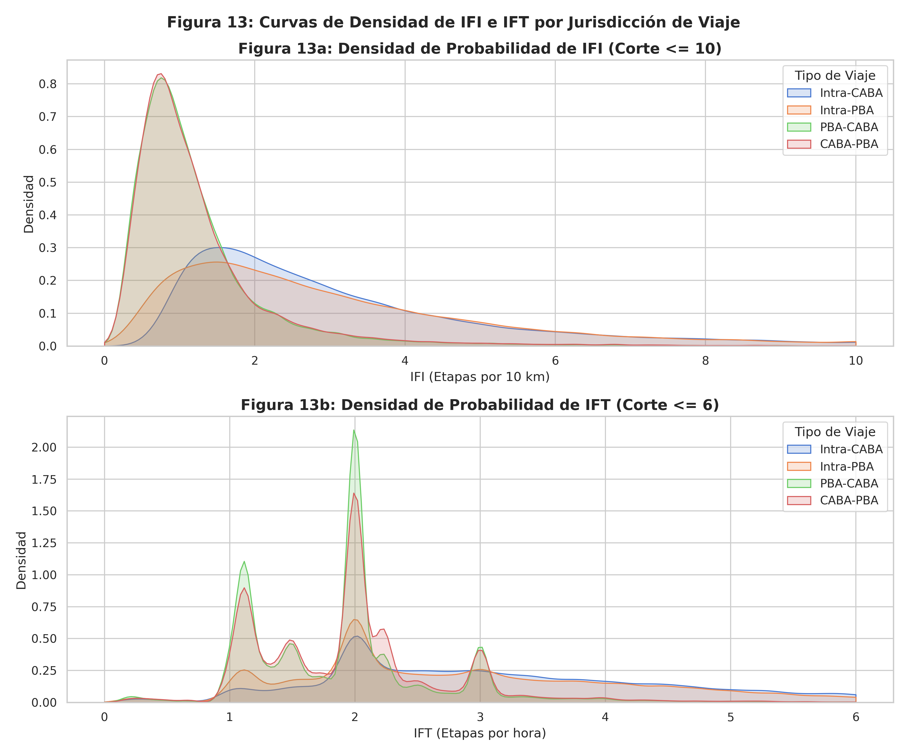

# Análisis de la Distribución de IFI y IFT

Este informe analiza la distribución del **Índice de Fricción Espacial (IFI)** y del **Índice de Fricción Temporal (IFT)** para viajes de transporte público en el Área Metropolitana de Buenos Aires (AMBA), segmentados según su jurisdicción de origen y destino:
- **Intra-CABA**: Origen y destino en la Ciudad Autónoma de Buenos Aires.
- **Intra-PBA**: Origen y destino en la Provincia de Buenos Aires (Conurbano).
- **PBA-CABA**: Origen en Provincia y destino en CABA (viaje de ida de conmuters).
- **CABA-PBA**: Origen en CABA y destino en Provincia (viaje de vuelta de conmuters).

---

## Definiciones de los Índices

1. **IFI (Índice de Fricción Espacial)**: Representa la cantidad de etapas (transbordos) que realiza un usuario por cada 10 km de distancia recorrida en línea recta.
   $$\text{IFI} = \frac{\text{cantidad\_etapas}}{\text{distancia\_km}} \times 10$$
   *Un IFI alto indica una alta densidad de transbordos en relación con la distancia recorrida (viajes cortos o muy fragmentados).*

2. **IFT (Índice de Fricción Temporal)**: Representa la cantidad de etapas (transbordos) por cada hora de duración del viaje.
   $$\text{IFT} = \frac{\text{cantidad\_etapas}}{\text{duracion\_horas}}$$
   *Un IFT alto representa una mayor fricción temporal en términos de transbordos por unidad de tiempo.*

---

## 1. Estadísticas Descriptivas

Los análisis estadísticos se realizaron sobre un total de **5.508.005 viajes válidos** (filtrando aquellos con distancia $\ge 0.5$ km y duración válida).

### Distribución de IFI (Etapas cada 10 km)

| Jurisdicción | Cantidad de Viajes | Promedio | Desv. Est. | Mínimo | P10 | P25 | Mediana (P50) | P75 | P90 | P95 | P99 | Máximo |
| :--- | :---: | :---: | :---: | :---: | :---: | :---: | :---: | :---: | :---: | :---: | :---: | :---: |
| **Intra-CABA** | 1.635.976 | 3,709 | 4,182 | 0,544 | 1,177 | 1,628 | **2,481** | 4,054 | 6,946 | 10,610 | 23,004 | 99,447 |
| **Intra-PBA** | 2.568.261 | 3,697 | 4,297 | 0,102 | 0,905 | 1,463 | **2,466** | 4,200 | 7,181 | 11,198 | 22,463 | 104,141 |
| **PBA-CABA** | 664.277 | 1,286 | 1,337 | 0,090 | 0,481 | 0,697 | **1,014** | 1,477 | 2,179 | 2,891 | 5,823 | 59,444 |
| **CABA-PBA** | 639.491 | 1,279 | 1,262 | 0,104 | 0,504 | 0,703 | **1,016** | 1,474 | 2,170 | 2,862 | 5,600 | 66,639 |

### Distribución de IFT (Etapas por hora)

| Jurisdicción | Cantidad de Viajes | Promedio | Desv. Est. | Mínimo | P10 | P25 | Mediana (P50) | P75 | P90 | P95 | P99 | Máximo |
| :--- | :---: | :---: | :---: | :---: | :---: | :---: | :---: | :---: | :---: | :---: | :---: | :---: |
| **Intra-CABA** | 1.635.976 | 2,170 | 0,622 | 0,095 | 2,000 | 2,000 | **2,000** | 2,000 | 2,000 | 4,000 | 4,000 | 10,000 |
| **Intra-PBA** | 2.568.261 | 2,243 | 0,718 | 0,095 | 2,000 | 2,000 | **2,000** | 2,000 | 4,000 | 4,000 | 4,000 | 14,000 |
| **PBA-CABA** | 664.277 | 2,407 | 0,893 | 0,105 | 2,000 | 2,000 | **2,000** | 3,000 | 4,000 | 4,000 | 4,000 | 12,000 |
| **CABA-PBA** | 639.491 | 2,494 | 0,954 | 0,100 | 2,000 | 2,000 | **2,000** | 3,000 | 4,000 | 4,000 | 5,000 | 10,000 |

---

## 2. Visualizaciones

### Gráfico 1: Comparativa de Rangos Intercuartiles (Boxplots)
El siguiente gráfico compara los diagramas de caja (boxplots) sin incluir los valores atípicos extremos para enfocar la visualización en los percentiles centrales. Las etiquetas numéricas indican la **mediana** de cada distribución.

### Gráfico 2: Curvas de Densidad de Probabilidad (KDE)
El siguiente gráfico ilustra las curvas de densidad de probabilidad estimadas por kernel (KDE). Esto permite observar la forma continua de la distribución para cada grupo de viajes.

*Nota: La densidad de IFT muestra picos muy marcados en valores discretos (2, 3, 4, etc.) debido a que las duraciones de los viajes calculadas desde las etapas se basan en diferencias enteras de horas (o en la aproximación de 0.5 horas para viajes de menor duración).*

---

## 3. Conclusiones y Observaciones Clave

1. **Fricción Espacial (IFI)**:
   - Los viajes **Intra-CABA** (mediana = **2.48**) e **Intra-PBA** (mediana = **2.47**) tienen una fricción espacial más de **dos veces superior** a la de los viajes interjurisdiccionales **PBA-CABA** (mediana = **1.01**) y **CABA-PBA** (mediana = **1.02**).
   - Esto se debe principalmente al efecto de la distancia recorrida: los viajes interjurisdiccionales cubren distancias significativamente mayores (medianas de ~17 km), por lo que la cantidad de transbordos por cada 10 km es proporcionalmente más baja, a pesar de que utilicen múltiples modos de transporte en un solo viaje.

2. **Fricción Temporal (IFT)**:
   - La **mediana** del IFT es idéntica en todas las jurisdicciones (**2.0 etapas por hora**), lo que refleja que el ritmo de transbordos mediano se mantiene estable.
   - Sin embargo, las medias y los percentiles superiores muestran que los viajes interjurisdiccionales presentan una fricción temporal ligeramente mayor. El tercer cuartil (P75) de IFT para viajes **PBA-CABA** y **CABA-PBA** es de **3.0 etapas/hora**, mientras que para los viajes internos (**Intra-CABA** e **Intra-PBA**) se mantiene en **2.0**. Esto indica que un sector relevante de los conmuters experimenta una alta concentración de transbordos en el tiempo de duración total de su viaje.
